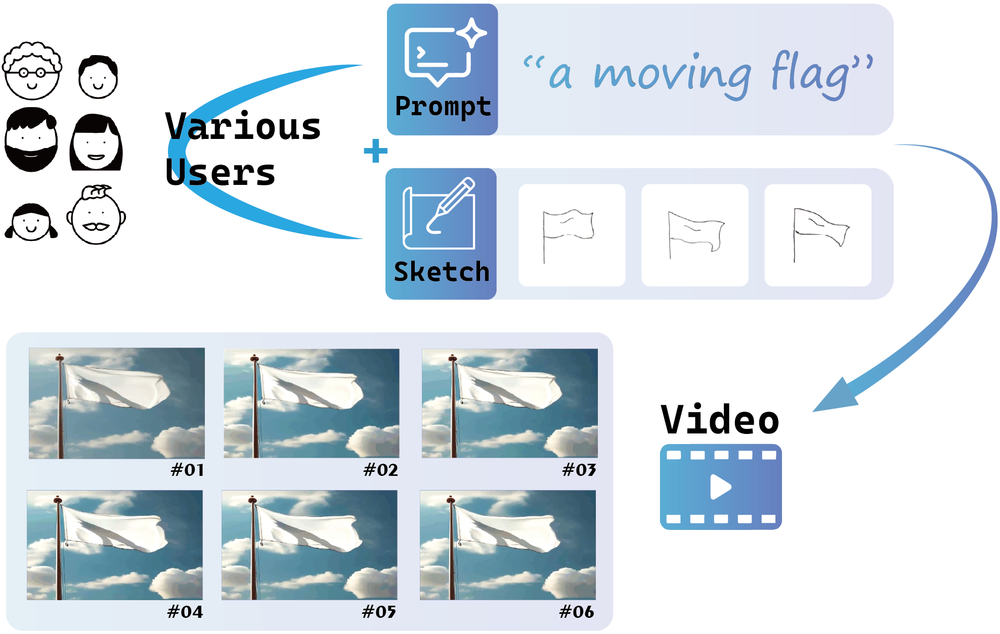
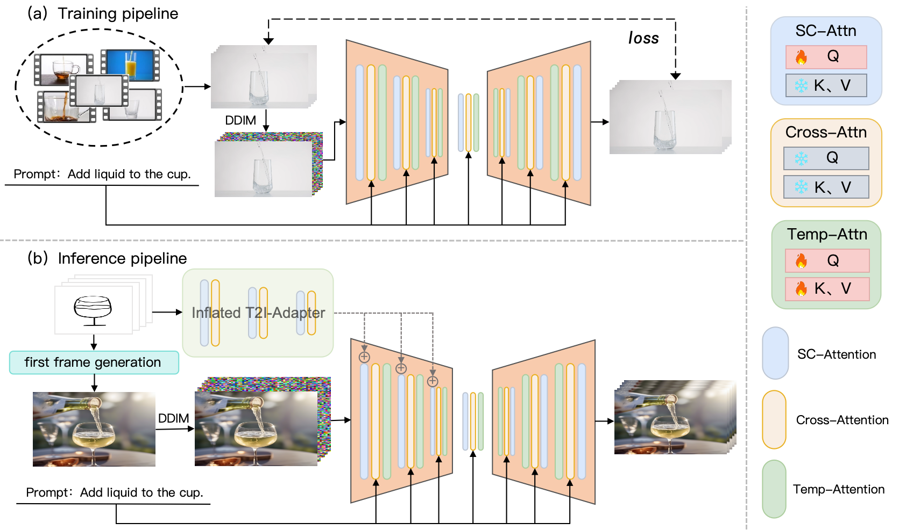
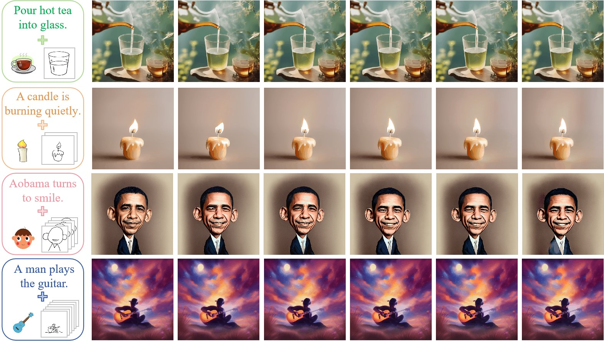

# <p align="center">VidSketch: Hand-drawn Sketch-Driven Video Generation with Diffusion Control</p>

<div style="text-align: center">
  
</div>

🚀 **VidSketch**, is the first to enable the generation of high-quality
video animations solely from any number of hand-drawn sketches and simple text prompts.

Our training was conducted on a single RTX4090 GPU using a small, high-quality dataset for each action category.

## News

- [2025/1/21] We add Google Drive link about our checkpoints and training data.
- [2025/1/21] We release our checkpoints.
- [2025/1/24] We have launched our website.
- [2025/1/28] Our code is now available.

## Abstract

Creating high-quality aesthetic images and video animations typically demands advanced drawing skills beyond ordinary users. While AIGC advancements have enabled automated image generation from sketches, these methods are limited to static images and cannot control video animation generation using hand-drawn sketches. To solve this problem, our method, VidSketch, is the first to enable the generation of high-quality video animations solely from any number of hand-drawn sketches and simple text prompts, thereby bridging the gap between ordinary users and artists. Moreover, to address the diverse variations in users' drawing skills, we propose the Abstraction-Level Sketch Control Strategy, which automatically adjusts the guidance strength of sketches during the generation process. Additionally, to tackle inter-frame inconsistency, we propose an Enhanced SparseCausal-Attention mechanism, significantly improving the spatiotemporal consistency of the generated video animations.

## Our Method

<div style="text-align: center">
  
</div>

Pipeline of our **Sketch2Video**. During the training phase, we train the SC-Attention and Temporal Attention blocks using high-quality, small-scale video datasets that we have searched for by category. This helps improve the spatiotemporal consistency of the generated video animations. During the inference stage, users only need to input their desired prompt along with any number of sketch sequences to generate high-quality video animations tailored to their needs. Specifically, the first frame is processed to generate the corresponding initial image, while the entire sketch sequence is fed into the Inflated T2I-Adapter to extract information, which is then injected into the upsampling layers of the VDM to control the video animation generation process.


## Preparation
### Dependencies and Installation


```bash
# clone the repo
git clone https://github.com/CSfufu/VidSketch.git
cd VidSketch

# create virtual environment
conda create -n VidSketch python=3.8
conda activate VidSketch

# install packages
pip install -r requirements.txt
```

### Weights and Data

To get started with VidSketch, you'll need to download both the pretrained model weights and the training data. These resources are essential for running the inference and training processes effectively.


## Get Started
### 1. Training
```bash
CUDA_VISIBLE_DEVICES=X python train_vidsketch.py --config configs/candle.yaml
```

### 2. Inference
Here is an example command for inference
```bash
# Motion Pattern
CUDA_VISIBLE_DEVICES=X python inference.py  --pretrain_weight stable-diffusion-v1-5/stable-diffusion-v1-5 -p "A candle burning quietly." --length 10 --image_path ./t2i_ske/candle --sketch_path ./sketch/candle --weight path_to_the_checkpoint

#########################################################################################################
# CUDA_VISIBLE_DEVICES=X  Specifies the GPU device number to use. `X` is the device ID. If multiple GPUs are available, you can list them separated by commas (e.g., `CUDA_VISIBLE_DEVICES=0,1`). If not explicitly specified, the first available GPU is used by default.
# python inference.py  Runs the `inference.py` script to perform inference. This script typically contains the logic for model inference.
# --pretrain_weight  Path to the pre-trained model weights. In this case, it points to the Stable Diffusion v1.5 model weights, which are used as the base for generating images or video frames.
# -p   Input text prompt. This is the description or prompt used to guide the model in generating the output. For example, the prompt `"A candle burning quietly."` will guide the model to generate related imagery or video.
# --length 10  Specifies the length of the video in terms of frames. In this case, the video will consist of 10 frames.
# --image_path   Path to the input image. This provides the directory where the input image or sketch is located (e.g., `./t2i_ske/candle`), which may serve as the starting frame or reference for video generation.
# --sketch_path  Path to the input sketch. This points to the directory containing the sketch image, often used as a rough outline to guide the model in generating more detailed images.
# --weight path_to_the_checkpoint Path to the fine-tuned model weights. This specifies the checkpoint of a model that has been fine-tuned, potentially using a method like DPO (Direct Policy Optimization). `path_to_the_checkpoint` is the path to the checkpoint file.

#########################################################################################################
```


## Visual Examples


We invite everyone to visit our official website to explore our website for additional case studies and experiments. 

<div style="text-align: center">
  
</div>


## License
Licensed under a [Creative Commons Attribution-NonCommercial 4.0 International](https://creativecommons.org/licenses/by-nc/4.0/) for Non-commercial use only.
Any commercial use should get formal permission first.


