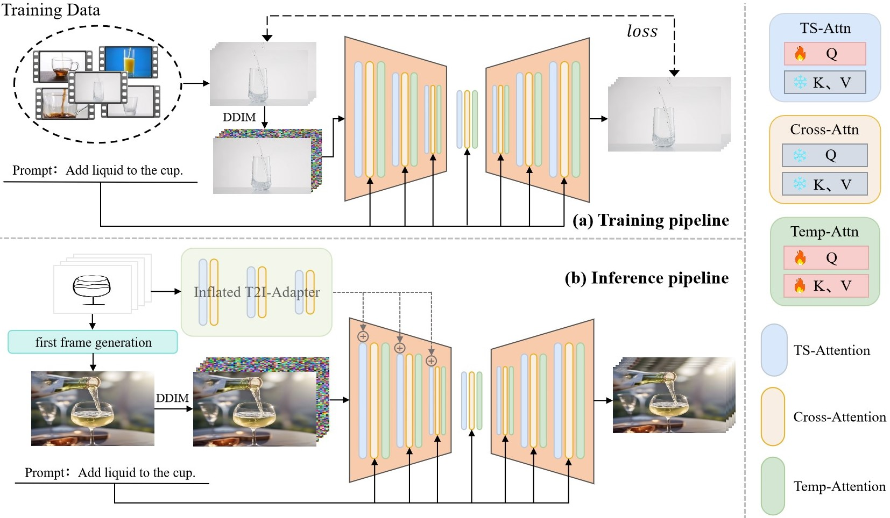

# <p align="center">VidSketch: Hand-drawn Sketch-Driven Video Generation with Diffusion Control</p>


[](https://github.com/CSfufu/VidSketch)
[](https://opensource.org/licenses/MIT)


[[Arxiv Paper](https://arxiv.org/abs/2502.01101)]&nbsp;
[[Website Page](https://csfufu.github.io/vid_sketch/)]&nbsp;
[[Google Drive](https://drive.google.com/drive/folders/1OPGiS5hzGLo8j3FFP-p9aVFlox91dYvC?usp=drive_link)]&nbsp;
[[Dataset](https://github.com/CSfufu/VidSketch/tree/main/sketch)]&nbsp;


🚀 **VidSketch**, is the first to enable the generation of high-quality
video animations solely from any number of hand-drawn sketches and simple text prompts.

Our training was conducted on a single RTX4090 GPU using a small, high-quality dataset for each action category.

## News

- [2025/3/21] We add Google Drive for our config.json file.
- [2025/1/21] We add Google Drive link about our checkpoints and training data.
- [2025/1/21] We release our checkpoints.
- [2025/1/24] We have launched our website.
- [2025/1/28] Our code is now available.
- [2025/2/4]  Our paper is now online on arxiv.

## Abstract

With the advancement of generative artificial intelligence, previous studies have achieved the task of generating aesthetic images from hand-drawn sketches, fulfilling the public's needs for drawing. However, these methods are limited to static images and lack the ability to control video animation generation using hand-drawn sketches. To address this gap, we propose <b>VidSketch</b>, the first method capable of generating high-quality video animations directly from any number of hand-drawn sketches and simple text prompts, bridging the divide between ordinary users and professional artists. Specifically, our method introduces a Level-Based Sketch Control Strategy to automatically adjust the guidance strength of sketches during the generation process, accommodating users with varying drawing skills. Furthermore, a TempSpatial Attention mechanism is designed to enhance the spatiotemporal consistency of generated video animations, significantly improving the coherence across frames.


## Our Method


Pipeline of our **Sketch2Video**. During the training phase, we train the SC-Attention and Temporal Attention blocks using high-quality, small-scale video datasets that we have searched for by category. This helps improve the spatiotemporal consistency of the generated video animations. During the inference stage, users only need to input their desired prompt along with any number of sketch sequences to generate high-quality video animations tailored to their needs. Specifically, the first frame is processed to generate the corresponding initial image, while the entire sketch sequence is fed into the Inflated T2I-Adapter to extract information, which is then injected into the upsampling layers of the VDM to control the video animation generation process.


## Preparation
### Dependencies and Installation


```bash
# clone the repo
git clone https://github.com/CSfufu/VidSketch.git
cd VidSketch

# create virtual environment
conda create -n VidSketch python=3.8
conda activate VidSketch

# install packages
pip install -r requirements.txt
```

### Weights and Data

To get started with VidSketch, you'll need to download both the pretrained model weights and the training data. These resources are essential for running the inference and training processes effectively.

#### Weights

- **Pretrained Weights**: The pretrained weights are based on a high-quality model trained on a small, categorized video dataset. These weights are necessary for generating the first frame or initializing the video generation process. You can download the pretrained weights from our [Google Drive link](https://drive.google.com/drive/folders/1OPGiS5hzGLo8j3FFP-p9aVFlox91dYvC?usp=drive_link).

- **Fine-tuned Weights**: If you wish to fine-tune the model on your own dataset, we provide fine-tuned weights that have been optimized using techniques like Direct Policy Optimization (DPO). Fine-tuning allows the model to generate more specialized videos based on your specific needs. You can download these weights from the same [Google Drive link](https://drive.google.com/drive/folders/1OPGiS5hzGLo8j3FFP-p9aVFlox91dYvC?usp=drive_link).

#### Data

- **Training Data**: Our training data consists of high-quality, small-scale video datasets categorized by various actions (e.g., objects moving, people dancing, etc.). These datasets were specifically curated for use with VidSketch to help improve spatiotemporal consistency in generated videos. You can access the data from our [Google Drive link](https://drive.google.com/drive/folders/1OPGiS5hzGLo8j3FFP-p9aVFlox91dYvC?usp=drive_link) and [dataset](https://github.com/CSfufu/VidSketch/tree/main/sketch).

- **Sketches and Prompts**: To generate your own videos, you will need a sequence of hand-drawn sketches along with simple text prompts. These sketches will serve as the foundation for the video, and the prompts will guide the video generation process. If you'd like to see examples of sketches and prompts, you can check out the [visual examples](#Visual-Examples) section.

Make sure you have the necessary files downloaded and set up before running any of the training or inference commands.


## Get Started
### 1. Training
```bash
CUDA_VISIBLE_DEVICES=X python train_vidsketch.py --config configs/candle.yaml
```

### 2. Inference
Here is an example command for inference
```bash
# Motion Pattern
CUDA_VISIBLE_DEVICES=X python inference.py  --pretrain_weight stable-diffusion-v1-5/stable-diffusion-v1-5 -p "A candle burning quietly." --length 10 --image_path ./t2i_ske/candle --sketch_path ./sketch/candle --weight path_to_the_checkpoint

#########################################################################################################
# CUDA_VISIBLE_DEVICES=X  Specifies the GPU device number to use. `X` is the device ID. If multiple GPUs are available, you can list them separated by commas (e.g., `CUDA_VISIBLE_DEVICES=0,1`). If not explicitly specified, the first available GPU is used by default.
# python inference.py  Runs the `inference.py` script to perform inference. This script typically contains the logic for model inference.
# --pretrain_weight  Path to the pre-trained model weights. In this case, it points to the Stable Diffusion v1.5 model weights, which are used as the base for generating images or video frames.
# -p   Input text prompt. This is the description or prompt used to guide the model in generating the output. For example, the prompt `"A candle burning quietly."` will guide the model to generate related imagery or video.
# --length 10  Specifies the length of the video in terms of frames. In this case, the video will consist of 10 frames.
# --image_path   Path to the input image. This provides the directory where the input image or sketch is located (e.g., `./t2i_ske/candle`), which may serve as the starting frame or reference for video generation.
# --sketch_path  Path to the input sketch. This points to the directory containing the sketch image, often used as a rough outline to guide the model in generating more detailed images.
# --weight path_to_the_checkpoint Path to the fine-tuned model weights. This specifies the checkpoint of a model that has been fine-tuned, potentially using a method like DPO (Direct Policy Optimization). `path_to_the_checkpoint` is the path to the checkpoint file.

#########################################################################################################
```


## Visual Examples


(We invite everyone to visit our official website to explore additional case studies and experiments. [[Website Page](https://csfufu.github.io/vid_sketch/)]&nbsp;)


## Citation
If you find our repo useful for your research, please cite us:
```
@misc{jiang2025vidsketchhanddrawnsketchdrivenvideo,
      title={VidSketch: Hand-drawn Sketch-Driven Video Generation with Diffusion Control},
      author={Lifan Jiang and Shuang Chen and Boxi Wu and Xiaotong Guan and Jiahui Zhang},
      year={2025},
      eprint={2502.01101},
      archivePrefix={arXiv},
      primaryClass={cs.CV},
      url={https://arxiv.org/abs/2502.01101},
}
```

## License
Licensed under a [Creative Commons Attribution-NonCommercial 4.0 International](https://creativecommons.org/licenses/by-nc/4.0/) for Non-commercial use only.
Any commercial use should get formal permission first.

<!--
## Acknowledgement
This repository is maintained by [Lifan Jiang](https://csfufu.life).
The code is built based on [LAMP](https://github.com/RQ-Wu/LAMP). Thanks for the excellent open-source code!!
-->
